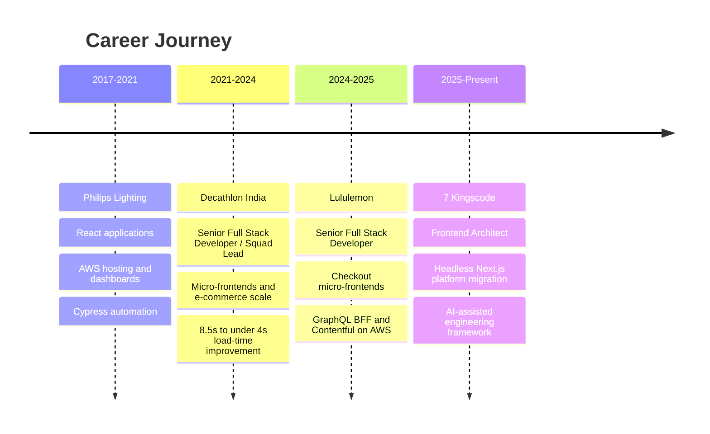
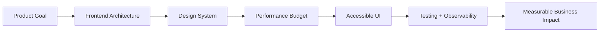
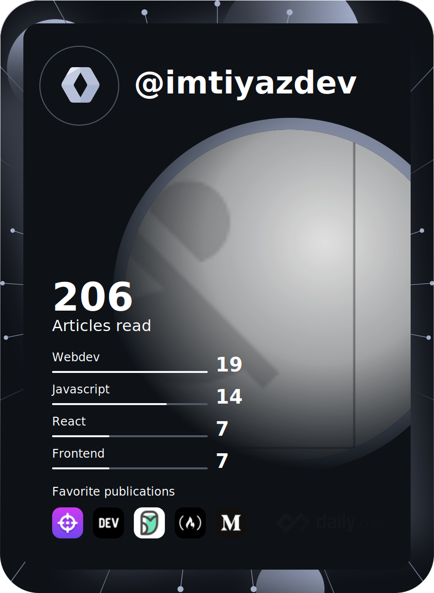

<div align="center">

  

  <br />

  
  
  
  

  <br />
  <br />

  <a href="https://mohammedimtiaz-portfolio.vercel.app/">
    
  </a>
  <a href="https://www.linkedin.com/in/mohammedimtiyaz-01/">
    
  </a>
  <a href="mailto:mohammedimtiyaz.jk@yahoo.com">
    
  </a>
  <a href="https://github.com/mohammedimtiyaz-1">
    
  </a>

</div>

---

##  About Me

I am a **Senior Frontend Lead / Frontend Architect** and **Toptal Network Talent** with **8+ years** of experience building high-performance, enterprise-grade web applications.

I specialize in **React, Next.js, TypeScript, frontend architecture, Core Web Vitals, micro-frontends, headless CMS platforms, GraphQL/BFF systems, and AI-enabled engineering workflows**.

```txt
Current focus   : Frontend architecture, AI-assisted delivery, scalable React platforms
Strengths       : Performance, architecture, leadership, product impact, developer experience
Location        : Bangalore, India
Work style      : Remote-first, ownership-driven, metric-oriented
Portfolio       : mohammedimtiaz-portfolio.vercel.app
```

---

##  Impact Snapshot

<table>
  <tr>
    <td align="center"><strong>8+ Years</strong><br />Production engineering</td>
    <td align="center"><strong>Toptal</strong><br />Network talent</td>
    <td align="center"><strong>8.5s -> &lt;4s</strong><br />Load time improvement</td>
    <td align="center"><strong>28%</strong><br />Conversion boost</td>
  </tr>
  <tr>
    <td align="center"><strong>1.5s</strong><br />LCP improvement</td>
    <td align="center"><strong>0.1</strong><br />CLS reduction</td>
    <td align="center"><strong>90%</strong><br />Feature delivery rate</td>
    <td align="center"><strong>Team Lead</strong><br />4 engineers</td>
  </tr>
</table>

---

##  Tech Arsenal

### Frontend


### Backend, APIs and Architecture


### Cloud, DevOps and CMS


### AI Engineering


---

##  Experience Timeline



### 7 Kingscode — Frontend Architect

`Oct 2025 - Present` · `Fully Remote`

- Own frontend platform architecture and migration from legacy CMS to headless Next.js + React.
- Define component systems, rendering patterns, performance budgets, and long-term UI standards.
- Lead AI-assisted engineering practices with guardrails, verification, and code review discipline.
- Own UI-facing integrations, BFF/API integration, CMS integration, and production observability.

### Lululemon — Senior Full Stack Developer

`Feb 2024 - Jun 2025` · `Fully Remote`

- Delivered checkout and bag features in a micro-frontend architecture using Next.js, React, Contentful, and AWS.
- Built GraphQL middle-tier integrations with Apollo Server and BFF patterns.
- Reduced checkout time by around 15%, improved LCP by 1.5s, and reduced CLS by 0.1.
- Worked with GitOps, Datadog, Splunk, Sentry, accessibility, and security practices.

### Decathlon India — Senior Full Stack Developer / Squad Lead

`May 2021 - Feb 2024` · `Bangalore, Hybrid`

- Led Decathlon e-commerce frontend development and micro-frontend adoption.
- Reduced load time from 8.5s to under 4s and contributed to a 28% conversion boost.
- Led 4 engineers with around 90% feature delivery rate.
- Owned SEO, accessibility, release cycles, design systems, Storybook, Sitecore JSS, and AWS workflows.

### Philips Lighting — Development Engineer / Frontend Engineer

`Aug 2017 - Apr 2021` · `Bangalore`

- Built responsive React applications and integrated REST APIs.
- Developed dashboards with D3.js and Chart.js.
- Used AWS S3, Route 53, and CloudFront for static hosting and CDN.
- Set up CI pipelines with TeamCity and introduced Cypress UI automation.

---

##  Featured Projects

<table>
  <tr>
    <td width="50%">
      <h3>AI Design System Diagram Assistant</h3>
      <p>AI-powered design system diagram generation with prompt enhancement, GitHub repo analysis, Mermaid output, conversational refinement, voice input, validation, and export.</p>
      <p>
        
        
        
        
      </p>
    </td>
    <td width="50%">
      <h3>AI Business Location Intelligence</h3>
      <p>Location intelligence platform using Google Maps/Places and OpenAI to identify market gaps, business opportunities, demand signals, and PDF reports.</p>
      <p>
        
        
        
      </p>
    </td>
  </tr>
  <tr>
    <td width="50%">
      <h3>AI Assessment MVP</h3>
      <p>Adaptive learning and assessment platform with PDF/document ingestion, OCR/NLP quiz generation, student analytics, access codes, and progress dashboards.</p>
      <p>
        
        
        
      </p>
    </td>
    <td width="50%">
      <h3>ADM Assessment IG</h3>
      <p>Full-stack AI middleware assessment with React, RTK Query, Zod, FastAPI, structured error handling, pagination, tests, coverage, and Vercel deployment.</p>
      <p>
        <a href="https://adm-assessment-ig.vercel.app/"></a>
        <a href="https://github.com/mohammedimtiyaz-1/ADM-assessment-IG"></a>
      </p>
    </td>
  </tr>
</table>

---

##  Engineering Operating System



<table>
  <tr>
    <td><strong>Architecture</strong><br />Micro-frontends, BFFs, domain boundaries, scalable React platforms.</td>
    <td><strong>Performance</strong><br />Core Web Vitals, SSR/SSG/ISR, streaming, bundle analysis, lazy loading.</td>
  </tr>
  <tr>
    <td><strong>Delivery</strong><br />GitOps, CI/CD, feature branches, code reviews, Agile/SAFe practices.</td>
    <td><strong>Observability</strong><br />Sentry, Datadog, Splunk, RUM, dashboards, alerting, production feedback loops.</td>
  </tr>
</table>

---

##  Certifications & Credibility


---

##  Articles & Thought Leadership

I write about **frontend architecture**, **AI integration patterns**, and **engineering leadership** on LinkedIn.

<table>
  <tr>
    <td><strong>10+</strong><br />Articles Published</td>
    <td><strong>15K+</strong><br />Total Impressions</td>
    <td><strong>4.2%</strong><br />Engagement Rate</td>
    <td><strong>40+</strong><br />Average Reactions</td>
  </tr>
</table>

Featured topics:

- How to integrate AI LLMs with frontend applications
- Types of AI agents for modern AI ecosystems
- Frontend performance and architecture
- React, Next.js, GraphQL, BFF, and CMS patterns

[](https://www.linkedin.com/in/mohammedimtiyaz-01/)

---

##  GitHub Rank, Streaks & Activity

<div align="center">

  
  

  <br />
  <br />

  

  <br />
  <br />

  

  <br />
  <br />

  

</div>

---

##  Pinned Repositories

<div align="center">

  <a href="https://github.com/mohammedimtiyaz-1/ADM-assessment-IG">
    
  </a>
  <a href="https://github.com/mohammedimtiyaz-1/ai-nearby-report">
    
  </a>
  <a href="https://github.com/mohammedimtiyaz-1/ai-diagram">
    
  </a>
  <a href="https://github.com/mohammedimtiyaz-1/langchain-nextjs">
    
  </a>

</div>

---

##  Reading & Learning

<div align="center">
  <a href="https://app.daily.dev/imtiyazDev">
    
  </a>
</div>

---

##  Let's Connect

Open to **senior frontend roles**, **frontend architecture work**, **technical leadership**, **Toptal-style remote engagements**, and **AI/product engineering collaborations**.

<div align="center">

  <a href="mailto:mohammedimtiyaz.jk@yahoo.com">
    
  </a>
  <a href="tel:+918197197997">
    
  </a>
  <a href="https://www.linkedin.com/in/mohammedimtiyaz-01/">
    
  </a>
  <a href="https://mohammedimtiaz-portfolio.vercel.app/">
    
  </a>

</div>

---

<div align="center">

  

</div>
